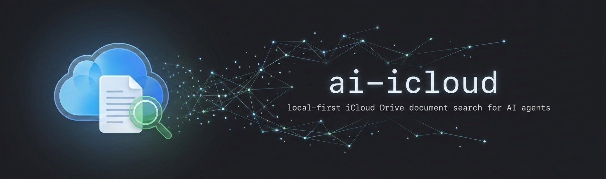
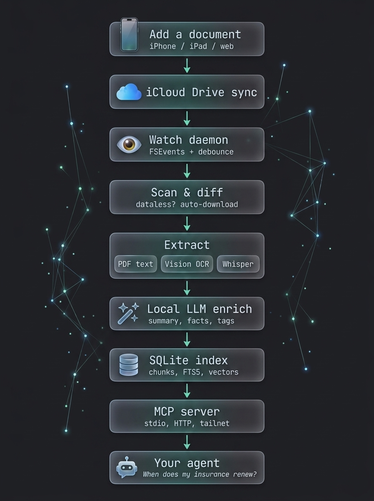

# ai-icloud



**Siri can't tell you what's in your iCloud Drive. And you don't want to
upload your closing statements, insurance policies, and tax documents to
ChatGPT to get answers about them.**

ai-icloud is the private, native way to put an AI agent on top of your
documents. It runs entirely on your Mac, reads everything in your iCloud
Drive — scanned PDFs, photos of receipts, saved emails, even voice memos —
and serves it to any AI agent you already use, over MCP. Nothing leaves
your machine.

## The digital filing cabinet, but it answers questions

Think of everything you would have put in a filing cabinet ten years ago:
closing statements, insurance policies, tax forms, tickets, legal
documents, warranties, that one important email you printed to PDF. Today
it's scattered across iCloud Drive — and when a question comes up, you're
back to digging through folders, squinting at scans.

Now you just ask your agent:

> **"Hey, when does my auto insurance renew?"**

It searches the index, finds the policy documents, reads the renewal date
out of the extracted facts, and answers with the exact figure *and* the
file that proves it — `Car/insurance.pdf`, page 1. Same for *"what were
my net proceeds when I sold the house?"*, *"what's my policy number?"*,
or *"find the parking pass for the games."* The answer comes with a
citation, so the proof is one click away instead of one drawer down.

## Why this exists

This is almost certainly where Siri is headed — an assistant that
actually knows your documents. Apple can't ship it yet: the privacy
problem is brutal at mass-market scale, and most people don't own
hardware that can run this stack. But if you have a capable Mac, you
don't have to wait. Everything — OCR, transcription, document
understanding, embeddings, search — runs locally. Document content only
ever goes to loopback endpoints unless you explicitly opt in to a remote
provider (`[privacy] allow_remote_endpoints`).

## What it does

A background daemon watches `~/Library/Mobile Documents/com~apple~CloudDocs`,
extracts text from everything it finds — PDF text layers, Apple Vision OCR for
scans and images, whisper.cpp transcription for audio/video — enriches each
document with a local LLM (summary, type, key-value facts, tags), embeds
everything into a SQLite index, and serves it to any MCP-capable agent:
Claude, or anything else that speaks MCP, on your Mac or (via your private
tailnet) your phone.

Sister project: [ai-imessage](https://github.com/tjameswilliams/ai-imessage) —
the same architecture over Apple Messages.

## Requirements

- macOS (Apple Vision OCR, PDFKit, FSEvents, launchd)
- Rust + Xcode Command Line Tools (`swiftc` builds the OCR sidecar at compile
  time; end users of a prebuilt binary don't need it)
- An OpenAI-compatible LLM server for enrichment and the `ask` tool — any
  provider works (LM Studio is the macOS happy path at
  `http://127.0.0.1:1234/v1`; Ollama, llama.cpp, vLLM, or hosted providers
  drop in via config; remote endpoints are an explicit privacy opt-in)
- `ffmpeg` for audio/video transcription (installed automatically by the
  brew formula; `brew install ffmpeg` for source builds)

## Install

```bash
brew install tjameswilliams/tap/ai-icloud   # prebuilt, codesigned binary
# or from source (needs Rust + Xcode CLT):
cargo build --release
```

## Onboarding

```bash
ai-icloud setup
```

The wizard walks through everything the two-pass design needs:

1. **What to index** — confirms the iCloud Drive folder is readable and
   counts the in-scope files.
2. **LLM backend** — ai-icloud extracts text locally (pass one) and then
   has a model interpret every document (pass two: summary, type, facts,
   tags). Any OpenAI-compatible inference server works — LM Studio,
   Ollama, llama.cpp, vLLM, or a hosted provider (sending content
   off-machine is an explicit opt-in the wizard asks about). The wizard
   probes the endpoint, walks the LM Studio happy path on macOS
   (install → Developer tab → Start Server → API token), lists the
   server's models, and verifies your pick answers before moving on. On
   Apple Silicon with 32 GB+ RAM it suggests a `gemma-4-12b` variant
   (multimodal, so one model covers text and page-image passes) — a
   suggestion, not a requirement; pick whatever your hardware runs well.
3. **Privacy boundary** — exclusion globs; excluded folders are never
   read and never enter the database.
4. **Transcription** — opt in/out of local whisper for audio/video.

Then:

```bash
ai-icloud scan             # index + enrich + embed (first run downloads models)
ai-icloud service install  # background daemon: indexes changes continuously
ai-icloud connect          # copy-pasteable MCP JSON for any agent framework
```

`connect` prints ready-to-paste client config for every form this install
supports — stdio for Claude Desktop/Claude Code/Codex/LM Studio, a Claude
Code one-liner, and (after `service install --http`) the HTTP URL +
bearer-token JSON for frameworks that speak streamable HTTP.

First scan downloads the embedding model (~130 MB); the first media file
downloads the whisper model (~1.6 GB). Both land under the index directory.
`ai-icloud doctor` diagnoses anything that goes sideways.

## Configuration

`~/Library/Application Support/ai-icloud/config.toml` — every key has a
default; the file is optional. The interesting ones:

```toml
[source]
root = "~/Library/Mobile Documents/com~apple~CloudDocs"
exclude_globs = ["Private/**"]   # never indexed, never stored

[llm]                            # OpenAI-compatible; LM Studio default
base_url = "http://127.0.0.1:1234/v1"
api_key = "sk-..."               # LM Studio: Developer → API token
model = "qwen/qwen3.6-27b"       # text enrichment + ask
vision_model = "qwen3.5-vl-9b-mlx-crack"  # page/image passes

[embeddings]
provider = "embedded"            # fastembed bge-small-en-v1.5, on-device

[transcription]
enabled = true
whisper_model = "large-v3-turbo"

[privacy]
allow_remote_endpoints = false   # loopback-only for llm + embeddings
```

`ai-icloud config show` prints the effective config with secrets redacted.

## Commands

| Command | Purpose |
|---|---|
| `scan [--dry-run] [--no-embed] [--no-enrich]` | one-shot index pass |
| `enrich [--force] [--limit N]` | run/redo LLM enrichment |
| `search <query> [--keyword\|--semantic]` | hybrid FTS5+vector search (RRF) |
| `watch` | foreground daemon (FSEvents + periodic reconciliation) |
| `service install\|start\|stop\|uninstall\|status` | launchd management |
| `serve [--http ADDR]` | MCP over stdio, or HTTP with a bearer token |
| `connect` | print (or mint) the HTTP bearer token |
| `doctor` | actionable environment checks |

## Using from MCP clients

`ai-icloud connect` prints all of this ready-to-paste for your install.

### Claude Code

```bash
claude mcp add --scope user ai-icloud -- "$(which ai-icloud)" serve
```

### Claude Desktop / LM Studio / Codex / other stdio clients

Add to the client's MCP config (`claude_desktop_config.json`, LM Studio's
`mcp.json`, `~/.codex/config.toml`'s equivalent, …):

```json
{
  "mcpServers": {
    "ai-icloud": { "command": "/opt/homebrew/bin/ai-icloud", "args": ["serve"] }
  }
}
```

### HTTP clients (Open WebUI, remote/mobile)

```bash
ai-icloud service install --http     # persistent server on 127.0.0.1:8788
ai-icloud connect                    # URL + bearer token as paste-ready JSON
```

The server binds loopback only. For phones or other machines, front it
with a private proxy — e.g. `tailscale serve --bg --https=8443
http://127.0.0.1:8788` — and keep the `Authorization: Bearer <token>`
header; the token guards your documents.

## MCP tools

`search_documents`, `get_document` (paged full text + facts + tags),
`get_chunk` (neighbor context), `list_documents` (filter by folder / type /
tag), `search_facts` (structured dates, amounts, parties, addresses),
`sync_status`, `reindex_file`, and `ask` — a server-side research loop where
the local model searches, reads, and answers with cited file paths.

## How indexing works

<p align="center">
  
</p>

1. **Scan** walks the tree (exclusion globs, extension scoping, size caps),
   detects iCloud eviction stubs (`.name.icloud`) and asks `brctl` to
   materialize them, and diffs size/mtime/sha256 against the index.
2. **Extract** per kind: pdfium-free PDF handling via a Swift sidecar
   (PDFKit text layer per page; pages without a usable layer are rendered at
   300 dpi and OCR'd by Apple Vision), image OCR (incl. HEIC), HTML tag
   stripping, whisper transcription with timestamps.
3. **Enrich**: one JSON-schema-constrained LLM call per document (with
   rendered page images for the vision model) produces title, doc_type,
   summary, facts, tags. The summary is embedded and searchable.
4. **Chunk + embed**: hash-keyed chunks (embeddings survive re-chunking and
   dedupe identical text), FTS5 mirror, raw-f32 vectors, brute-force cosine +
   BM25 fused with reciprocal rank fusion.

The watch daemon treats any FSEvent as a wake-up, debounces until the change
stream settles, and re-runs the (cheap) scan diff; a periodic tick reconciles
anything FSEvents dropped. Every stage is per-file/per-doc transactional, so
a crash or restart resumes cleanly.

## Privacy

- Everything — OCR, transcription, enrichment, embeddings, search — runs on
  your machine. Document content is only ever sent to loopback endpoints;
  a non-loopback `base_url` is refused unless you set
  `[privacy] allow_remote_endpoints = true`.
- `exclude_globs` folders are never read and never enter the database.
  Decide before the first scan: anything indexed is readable by every
  MCP client you connect.
- The index lives at `~/Library/Application Support/ai-icloud/` with
  owner-only permissions (0700 dir, 0600 database and tokens).
- Logs contain file paths and counts, never document content.
- To erase everything: `ai-icloud service uninstall && rm -rf
  ~/Library/Application\ Support/ai-icloud`.

## Full Disk Access

launchd runs the binary directly, so if the daemon logs permission errors on
`~/Library/Mobile Documents`, grant Full Disk Access to the **binary itself**
(System Settings → Privacy & Security → Full Disk Access). Rebuilding an
unsigned binary invalidates the grant — codesign release builds.

## Development

```bash
cargo test          # 140+ tests; offline via the debug-hash embedder,
                    # synthetic fixture trees, no real user data
cargo clippy --all-targets
scripts/release.sh <version>   # codesigned (optionally notarized) release
                               # + Homebrew formula stanza
```

Building needs the Xcode Command Line Tools: `build.rs` compiles the Swift
Vision-OCR sidecar and embeds it in the binary. Architecture notes live in
[SPEC.md](SPEC.md).

**Production path rule:** everything user-facing — the launchd daemon and
all MCP registrations, including on the development machine — runs the
Homebrew-installed binary (`/opt/homebrew/bin/ai-icloud`), never
`target/release`. macOS anchors the iCloud-Drive/Full Disk Access grant to
the code-signing identity; only the Developer ID-signed brew binary keeps
that grant across upgrades. Releases flow: bump version → tag →
`gh release create` → `scripts/release.sh` → update the tap formula →
`brew upgrade`. Local builds are for `cargo test` and manual CLI runs only.

## License

Dual-licensed under either of

- Apache License, Version 2.0 ([LICENSE-APACHE](LICENSE-APACHE))
- MIT license ([LICENSE-MIT](LICENSE-MIT))

at your option.
